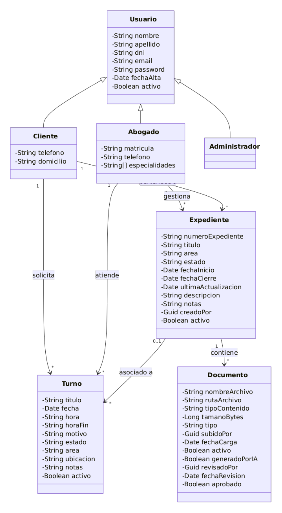

# Minuta de Relevamiento

**Proyecto:** Legal Manager (Sistema de Gestión para Estudio Jurídico)
**Fecha:** 18 de Agosto de 2026
**Equipo de Desarrollo:** Agustín Angelini, Franco Cuscianna, Thiago Cuscianna

## 1. Temática de la Aplicación

El proyecto consiste en el desarrollo de Legal Manager, un sistema informático orientado a la administración y gestión operativa de un estudio jurídico. El objetivo principal es digitalizar y centralizar la información de los casos legales (expedientes), optimizar la agenda de los profesionales mediante un sistema de turnos interactivo, y ordenar el acceso a la información según el rol de cada usuario. La plataforma incorpora además un módulo de gestión documental real, que permite adjuntar archivos PDF a cada expediente y generar automáticamente documentos como constancias o un resumen narrativo del caso, redactado mediante inteligencia artificial a partir de los datos ya cargados en el sistema y sujeto a revisión por parte de un abogado. Legal Manager funciona así como un nexo de comunicación estructurado entre los abogados del estudio y sus clientes, y como repositorio confiable de la actividad de cada caso.

## 2. Roles de Usuario Identificados

El sistema contará con autenticación (basada en JWT) y control de acceso estructurado en tres roles principales:

- **Administrador del sistema (Admin):** dueño del estudio jurídico, encargado de la configuración general y la administración del personal y usuarios.
- **Abogado:** profesional del estudio encargado de llevar adelante los casos, atender las consultas y gestionar su documentación.
- **Cliente:** usuario final que requiere los servicios legales del estudio y necesita dar seguimiento a su situación.

El Cliente es el único rol que puede autorregistrarse en el sistema; las cuentas de Abogado y Administrador son creadas exclusivamente por el Administrador. El rol asignado a un usuario es fijo e inmutable.

## 3. Funcionalidades Principales (Alcance del Sistema)

A continuación, se detallan las funcionalidades con las que debe cumplir el sistema, categorizadas por módulo o actor:

### A. Módulo de Gestión de Usuarios (Admin)

- **Administración (CRUD):** el administrador deberá poder crear, leer, actualizar y dar de baja cuentas de usuario mediante baja lógica (desactivación), sin eliminarlas de forma permanente.
- **Registro por tipo de cuenta:** el sistema permite registrar usuarios como Administradores, Abogados o Clientes según el tipo de cuenta creada, restringiendo sus vistas y permisos de acuerdo al tipo correspondiente.
- **Administradores:** el administrador puede crear y dar de baja a otros administradores, excepto darse de baja a sí mismo.

### B. Módulo de Gestión de Expedientes (Casos Legales)

- **Seguimiento de Casos:** el sistema debe permitir el registro (Alta, Baja y Modificación) de los expedientes legales.
- **Vinculación:** cada expediente debe estar obligatoriamente vinculado a uno o más Abogados que lo gestionan, y a un Cliente al que le pertenece; no puede quitarse el último abogado responsable.
- **Gestión de responsables:** un abogado o el administrador pueden agregar o quitar abogados responsables de un expediente en cualquier momento, respetando la regla anterior.
- **Portal del cliente:** los clientes deberán tener una vista exclusiva donde puedan consultar el estado actual y seguimiento de sus casos activos.
- **Panel del abogado:** los abogados deberán poder listar, revisar y actualizar el estado de los múltiples expedientes que tengan asignados.

### C. Módulo de Agenda y Turnos

- **Calendario interactivo:** la aplicación deberá incluir una interfaz de calendario dinámica para la gestión visual de las citas.
- **Solicitud de turnos:** el sistema debe permitir a los clientes solicitar turnos con los abogados por diversos motivos, asociados o no a un expediente.
- **Disponibilidad:** el sistema debe permitir consultar la disponibilidad horaria de un abogado en una fecha antes de solicitar un turno.
- **Ciclo de vida del turno:** los turnos pueden confirmarse, cancelarse o reprogramarse.
- **Gestión de agenda:** los abogados deberán poder visualizar su calendario de turnos asignados, gestionar su disponibilidad y hacer seguimiento de sus próximas citas.

### D. Módulo de Gestión Documental

- **Carga y almacenamiento:** subida de archivos PDF reales (hasta 10 MB) asociados a un expediente, en distintos tipos: escritos, contratos, pruebas, el expediente digitalizado, o documentos generados por el sistema.
- **Consulta y descarga:** listado y descarga de los documentos vinculados a cada expediente, con baja lógica de documentos.
- **Generación automática:** el sistema puede generar documentos por plantilla fija, como constancias del expediente.
- **Resumen por Inteligencia Artificial:** generación de un resumen narrativo del expediente a partir de los datos y actuaciones ya cargados en el sistema, quedando en estado de borrador hasta que un abogado lo revisa y lo aprueba o descarta.

### E. Funcionalidades Transversales (UX/UI y Seguridad)

- **Control de acceso:** login seguro para todos los usuarios.
- **Accesibilidad visual:** inclusión de un interruptor para alternar la interfaz entre "Modo Claro" y "Modo Oscuro" (Light/Dark Theme), mejorando la experiencia de uso.

## 4. Reglas de Negocio

### A. Estados y ciclo de vida

- **Estados del expediente: activo, pendiente, cerrado.** Al cerrar un expediente se registra su fecha de cierre. Un expediente cerrado no puede modificarse, reabrirse, ni recibir nuevos documentos adjuntos.
- **Estados del turno: pendiente, confirmado, cancelado.** Un turno confirmado cuya fecha y hora ya transcurrieron se considera finalizado (se calcula automáticamente, no se persiste como tal).
- **Baja lógica:** ninguna entidad se elimina de forma física; únicamente se desactiva y deja de visualizarse.

### B. Vinculaciones

- Cada expediente debe estar vinculado a al menos un abogado y a un único cliente; no puede quitarse el último abogado responsable.
- Un turno puede asociarse a un expediente de forma opcional (0..1); si está asociado, hereda su área.
- El expediente es creado por un abogado (o el administrador), que asigna el cliente y al menos un abogado responsable.
- Un cliente puede no tener expedientes ni abogados vinculados hasta que se cree su primer expediente o turno.
- Un abogado solo puede gestionar expedientes y turnos de los clientes que están vinculados a él mediante los expedientes que gestiona.
- Cada documento debe estar vinculado obligatoriamente a un expediente y al usuario que lo subió; un documento no puede existir sin un expediente asociado.
- Un documento generado por IA queda vinculado, de forma opcional, al abogado que lo revisó, hasta que este lo aprueba o lo descarta.

### C. Agenda y turnos

- Conflicto de agenda: un abogado no puede tener más de un turno activo en el mismo día y franja horaria, tanto al crear como al reprogramar un turno.
- El abogado puede agendar turnos en nombre de sus clientes.
- Un turno asociado a un expediente hereda su área; sin expediente, registra su propia área.

### D. Roles y registración

- Solo los clientes se registran de forma autónoma. Los abogados son creados por el administrador y el administrador por el sistema.
- El rol de un usuario es fijo e inmutable: no puede cambiarse (ej. de cliente a abogado).
- El administrador puede crear y dar de baja otros administradores, excepto darse de baja a sí mismo.

### E. Datos

- La descripción y las notas del expediente son ambas opcionales.
- El abogado registra su teléfono, visible para sus clientes.
- El cliente registra su domicilio y teléfono (opcionales) para notificaciones y contactos.
- El email y el DNI de un usuario deben ser únicos en el sistema, tanto al crear como al actualizar un usuario.
- El número de expediente (CaseNumber) debe ser único en el sistema.

### F. Documentos e Inteligencia Artificial

- Solo se aceptan documentos en formato PDF, con un tamaño máximo de 10 MB por archivo.
- No se pueden adjuntar documentos a un expediente cerrado.
- El resumen generado por IA se redacta únicamente a partir de los datos ya registrados en el expediente; no incorpora información externa.
- Un documento generado por IA no queda disponible como documento oficial del expediente hasta que un abogado lo revisa y aprueba; hasta entonces se considera un borrador, y solo puede ser revisado una vez. Los documentos subidos directamente por los usuarios no requieren revisión.
- Un usuario no puede darse de baja (lógica) si tiene expedientes o turnos activos asociados; un expediente no puede darse de baja si tiene turnos activos asociados.

## 5. Tecnologías, Herramientas y Plataformas

Se reutiliza el frontend de la versión anterior, incorporando un backend robustecido y el módulo de gestión documental:

- **Frontend:** React 19 (con Vite), Bootstrap 5 / React-Bootstrap, React Router DOM, Context API y Axios.
- **Backend:** API REST en .NET (ASP.NET Core), con arquitectura en capas y autenticación JWT.
- **Base de datos:** Microsoft SQL Server, con Entity Framework Core (migraciones Code-First).
- **Gestión documental:** librería QuestPDF para la generación de PDFs, y almacenamiento de archivos en el servidor.
- **Inteligencia Artificial:** integración con la API de un modelo de lenguaje para la redacción del resumen narrativo del expediente.
- **Control de versiones y despliegue:** Git / GitHub, con API en Azure App Service, Frontend en Vercel y base de datos en Azure SQL.

## 6. Matriz de Permisos

| Funcionalidad | Administrador | Abogado | Cliente |
|---|---|---|---|
| Gestión de Usuarios (CRUD) | Sí | No | No |
| Crear/actualizar expedientes | Sí | Sí | No |
| Cambiar estado de expediente | Sí | Solo los que gestiona | No |
| Consultar expedientes | Sí | Solo los que gestiona | Solo propios |
| Solicitar turnos | Sí | Sí, de sus clientes | Sí |
| Gestionar turnos (Confirmar/Cancelar/Reprogramar) | Sí | Sí, de sus clientes | Solo propios |
| Consultar agenda | Sí | Su calendario | Solo propios |
| Subir / descargar documentos PDF | Sí | Sí, de sus expedientes | Solo consulta/descarga de los propios |
| Generar y aprobar resumen por IA | Sí | Sí (aprueba) | No |

## 7. Anexo: Diagrama de Clases Conceptual

Como respaldo al relevamiento, se presenta el modelo conceptual de dominio actualizado —sin componentes de base de datos ni métodos—, incorporando la entidad Documento y reflejando las entidades y relaciones detectadas en las funcionalidades requeridas.

